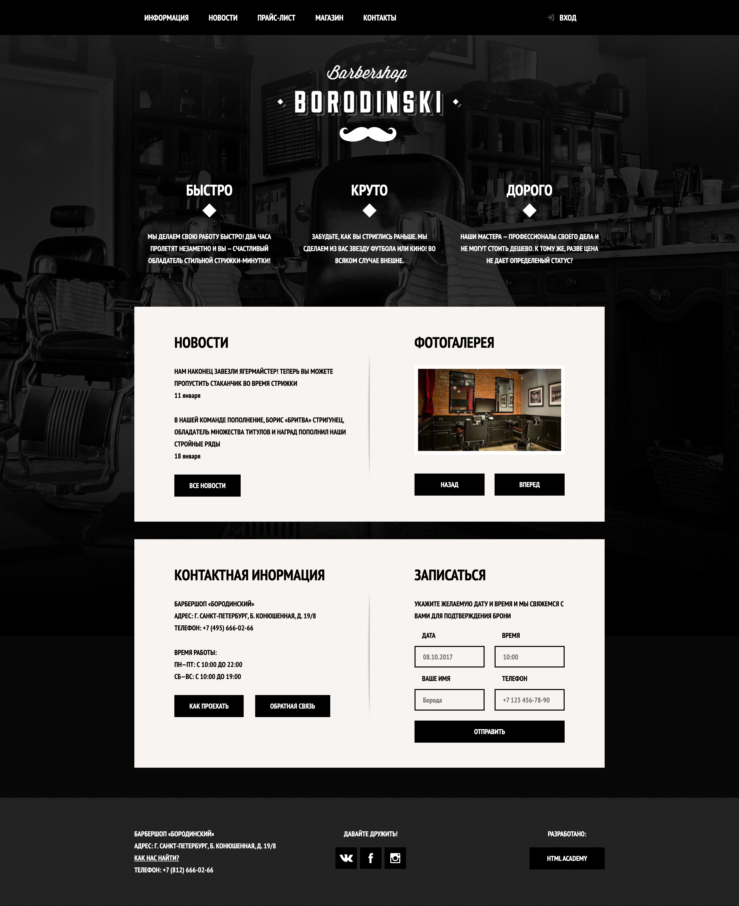

# Barbershop

<div align="center">

[](https://developer.mozilla.org/docs/Web/Guide/HTML/HTML5) [](https://developer.mozilla.org/docs/Web/CSS) [](https://developer.mozilla.org/docs/Web/JavaScript)

</div>

## Overview

Static multi-page barbershop website template. Built with semantic HTML, custom CSS, and a small amount of vanilla JavaScript for modals and interactivity. Useful as a learning artifact and reference for basic layout and UI patterns.

## Key Features

- Multi-page structure: home, catalog, product, and price pages
- Modal interactions: login and map popups with basic JS
- Simple, framework-free stack that is easy to run anywhere

## Tech Stack

HTML5, CSS3, JavaScript (vanilla)

## Architecture

Static site with pages in `index.html` and `app/pages`. Styles live in `app/css`; scripts in `app/js` (`modal-login.js`, `modal-map.js`). No build tooling, database, or server runtime.

## Performance & Accessibility

Lightweight static assets with basic image optimization. Emphasis on semantic markup and keyboard-accessible modals; easy to host via any static server or CDN.

## Prerequisites

- None required (open `index.html` directly)
- Optional: Node.js `>=18` or Python `>=3.8` to run a local static server

## Installation

```bash
git clone git@github.com-personal:maxgalchenko/Barbershop.git
cd Barbershop
```

## Quick Start

```bash
# Option A: open directly
open index.html

# Option B: Python static server (http://localhost:8000)
python3 -m http.server 8000

# Option C: Node static server (requires Node.js)
npx serve -l 8000 .
```

Open http://localhost:8000

## Available Scripts

- None

## Screenshots



---

<div align="center">

Built with ❤️ by [Maksym Galchenko](https://github.com/maxgalchenko)

[](https://www.linkedin.com/in/galchenko-max/) [](https://portfolio-green-six-29.vercel.app/) [](mailto:galchenko.maksym@gmail.com) 

</div>
